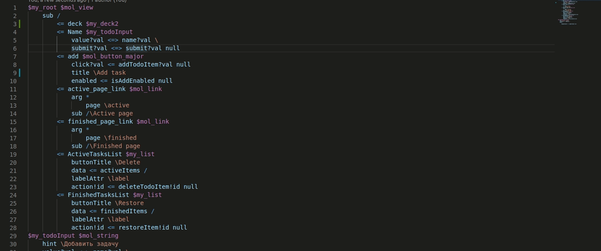

# tree-language-service README

Provides intellisense support for .tree files of $mol framework.

Note: All features require for file to be saved and compiled;

## Features

    Navigation (Go to Definition)

## RoadMap

    1) Diagnostics
    2) Completions (50% ready, suspended)

## Known Issues

....

## Release Notes

### 1.0.0
Initial release. Navigation (Go to Definition) implemented.

## Navigation

